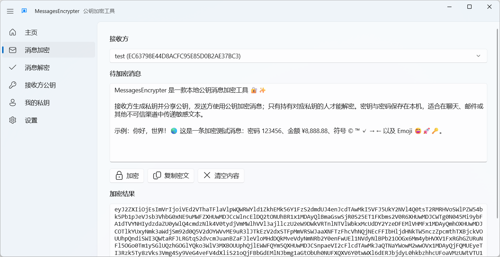
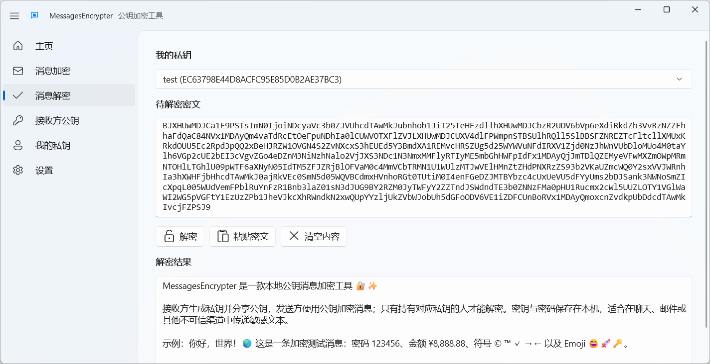
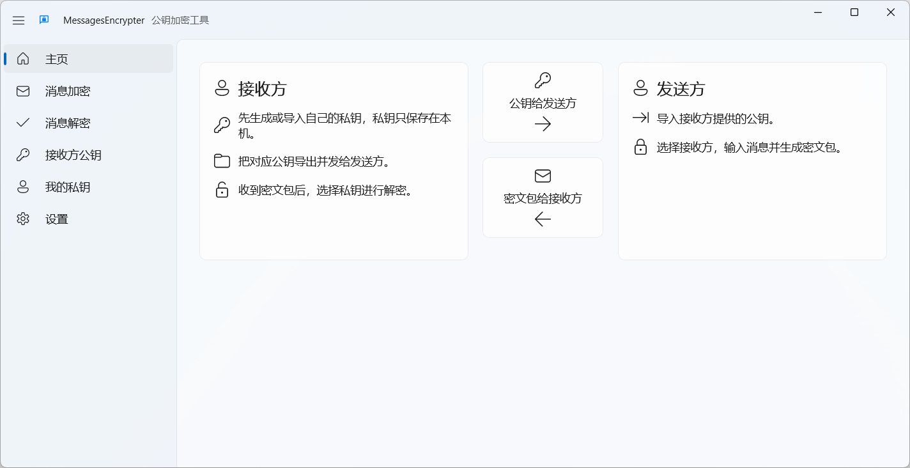

# MessagesEncrypter

## 一、程序介绍

本程序是 Windows 桌面端公钥加密工具，帮助用户使用接收方公钥加密消息，并使用自己的私钥解密收到的密文包。

程序支持管理多个接收方公钥和多个个人私钥。每个私钥可以独立设置密码，并可按需保存到 Windows 凭据管理器；密钥存档保存在应用本地数据目录。

消息加密使用 RSA + OAEP-SHA256 加密 AES-256-GCM 会话密钥，再使用 AES-GCM 加密消息正文。生成密钥时可选择 2048、3072、4096 或 8192 位 RSA，导入密钥支持 RSA-2048 及以上位数。

## 二、如何下载

即将上线 Microsoft Store。

## 三、软件截图

## 四、使用说明

## 五、开发者信息

- 项目仓库：<https://github.com/BlazeSnow/MessagesEncrypter>
- 项目官网：<https://www.blazesnow.com/messages/>
- 反馈邮箱：<messages@blazesnow.com>

## 六、版权信息

Copyright © 2026 BlazeSnow. 保留所有权利。

以GNU Affero General Public License v3.0的条款发布。

## 七、更新日志

更新日志见：<https://github.com/BlazeSnow/MessagesEncrypter/blob/main/CHANGELOG.md>
